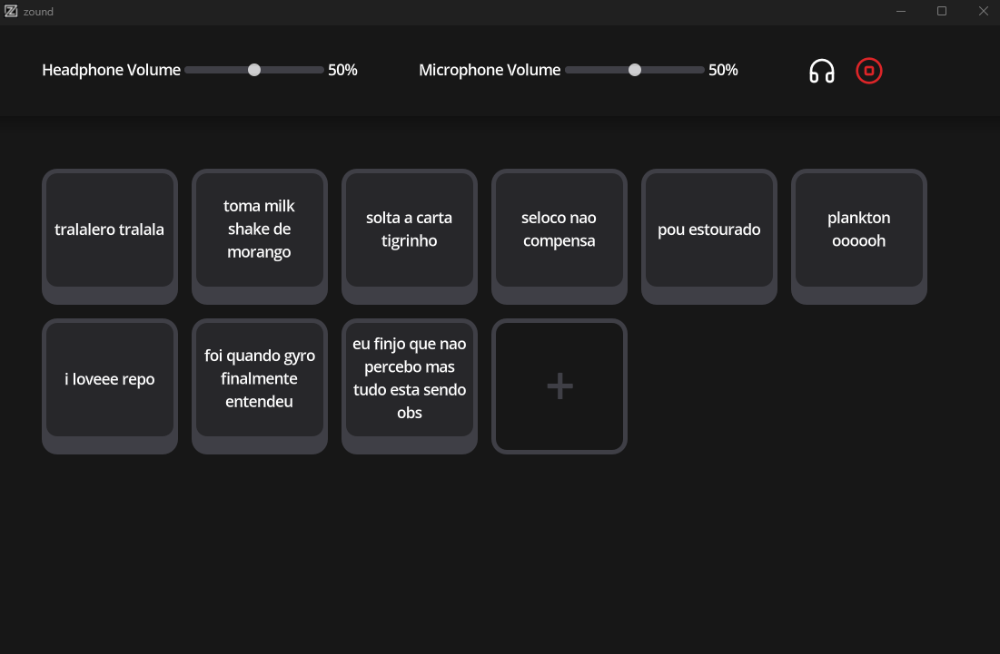

#  Zound-GUI

[Zound-GUI](https://github.com/Bielgomes/zound-gui) is a graphical user interface (GUI) for [Zound](https://github.com/Bielgomes/zound).

> [!WARNING]
> *To developers*: This version of Zound-GUI requires [Zound v1.1.0](https://github.com/Bielgomes/zound) to work.

> [!CAUTION]
> Zound/Zound-GUI requires [Python 3.12](https://www.python.org/downloads/). Compatibility with earlier versions is not guaranteed!

> [!WARNING]
> Zound/Zound-GUI depends on [Voicemeeter](https://vb-audio.com/Voicemeeter/) being installed, configured, and running properly. Follow this [Tutorial](https://www.youtube.com/watch?v=8ymkY6Ppyzo) for basic setup instructions!

## Contributors

